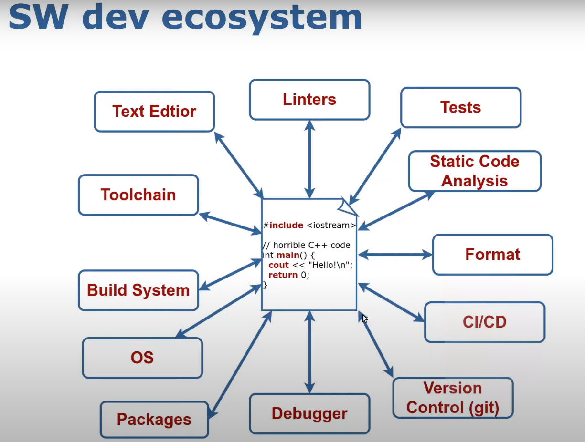

# C/C++ 

## Build

* [Modern C++ Course, Lecture 1: Build Systems](https://www.youtube.com/watch?v=zOmUHM0sFOc&list=PLgnQpQtFTOGRv7VS6fYerEbT4ckBovKur&index=4)
* [Build Systems à la Carte](https://github.com/snowleopard/build/releases/tag/jfp-preprint)
* [Mixing Python and compiled languages](https://enccs.github.io/cmake-workshop/python-bindings/)

## With Python
* [Seamless operability between C++11 and Python](https://github.com/pybind/pybind11)
* [Mixing Compiled Code and Python" mimi-course](https://github.com/henryiii/python-compiled-minicourse)

